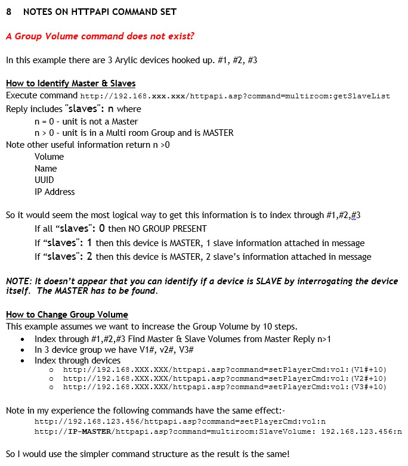

# python-linkplay

A Python Library for Seamless LinkPlay Device Control

## Intro

Welcome to python-linkplay, a powerful and user-friendly Python library designed to simplify the integration and control of LinkPlay-enabled devices in your projects. LinkPlay technology empowers a wide range of smart audio devices, making them interconnected and easily controllable. With python-linkplay, you can harness this capability and seamlessly manage your LinkPlay devices from within your Python applications.

## Key features

1. Unified Control: python-linkplay provides a unified interface for controlling various LinkPlay-enabled devices, streamlining the process of interacting with speakers, smart home audio systems, and more.

2. Device Discovery: Easily discover and connect to LinkPlay devices on your network, ensuring a hassle-free setup and integration into your Python applications.

3. Playback Management: Take charge of audio playback on LinkPlay devices with functions to play, pause, skip tracks, adjust volume, and more, offering a comprehensive set of controls for a seamless user experience.

4. Metadata Retrieval: Retrieve essential metadata such as track information, artist details, and album data, enabling you to enhance the user interface and display relevant information in your applications.

## LinkPlay API documentation

- https://github.com/n4archive/LinkPlayAPI
- https://github.com/nagyrobi/home-assistant-custom-components-linkplay
- https://github.com/ramikg/linkplay-cli
- https://developer.arylic.com/httpapi/
- http://airscope-audio.net/core2/pdf/airscope-module-http.pdf
- https://www.wiimhome.com/pdf/HTTP%20API%20for%20WiiM%20Mini.pdf
- https://www.wiimhome.com/pdf/HTTP%20API%20for%20WiiM%20Products.pdf
- https://github.com/DanBrezeanu/wiim-extended-http-api
- https://github.com/cvdlinden/wiim-httpapi

## Multiroom

